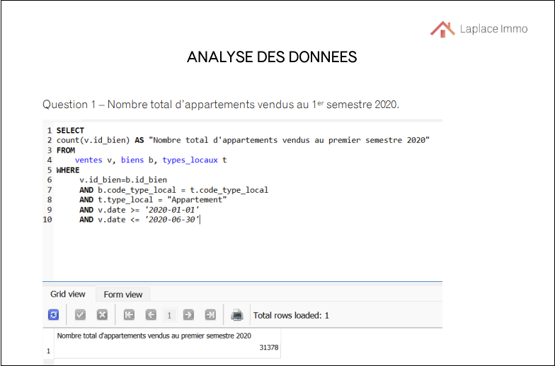

# Analyste de données néo-zélandaise vivant en France
#### Compétences techniques : Python, SQL, PowerBI, Tableau, Excel

Professionnelle enthousiaste, curieuse et analytique, avec neuf ans d'expérience internationale dans des rôles axés sur la recherche, collaborant avec des organisations basées aux États-Unis, en Nouvelle-Zélande et à Londres. Récemment diplômée d'une licence en Analyse de Données et à la recherche d'un poste qui me permettra de valoriser mon diplôme et mon expérience antérieure en recherche et analyse de marché

## Mon Portfolio 
### Détection des faux billets de banque à l'aide de l'apprentissage automatique 

> Étapes clés
> - Créer une régression linéaire pour imputer les données manquantes
> - Créer des régressions logistiques avec Statsmodels et Scikit-Learn
> - Utiliser le clustering k-means
> - Déterminer le meilleur modèle d'apprentissage automatique et prédire avec succès si les billets de banque sont réels ou faux
>  
> #### En savoir plus sur le projet [ICI](https://flossytoo.github.io/portfolio-france/projet_10/billets)

### Étude de marché pour une entreprise alimentaire cherchant à s'implanter à l'international

> Étapes clés
> - Préparer, nettoyer et effectuer une analyse exploratoire des données fournies
> - Fusionner les ensembles de données
> - Effectuer une Classification Ascendante Hiérarchique
> - Utiliser le clustering k-means
> - Effectuer une Analyse en Composantes Principales
> - Identifier les meilleurs pays pour une expansion internationale
>
> #### En savoir plus sur le projet [ICI](https://flossytoo.github.io/portfolio-france/projet_9/poulet)

### Étude sur le développement de l'eau dans le monde

> Étapes clés
> - Élaborer un plan détaillant les indicateurs clés et les graphiques requis
> - Développer une maquette de tableaux de bord aux niveaux mondial, régional et national
> - Créer une histoire Tableau avec des tableaux de bord aux niveaux mondial, régional et national
> - Déterminer les meilleurs pays pour la création de services d'eau, l'amélioration des services d'eau et les services de conseil
>
> #### En savoir plus sur le projet [ICI](https://flossytoo.github.io/portfolio-france/projet_8/eau_potable)

### Analyse des indicateurs d'égalité des sexes au sein d'une entreprise

> Étapes clés
> - Préparer les données dans KNIME, en respectant les règles du RGPD
> - Créer des graphiques montrant les indicateurs d'égalité à l'aide de KNIME
> - Analyser les principales conclusions afin de fournir des informations exploitables
> 
> #### En savoir plus sur le projet [ICI](https://flossytoo.github.io/portfolio-france/projet_7/femme_homme)

### Analyse des ventes pour un vendeur de livres en ligne

> Étapes clés
> - Préparer, nettoyer et effectuer une analyse exploratoire des données fournies
> - Examiner les indicateurs de ventes (évolution du chiffre d'affaires au fil du temps, chiffre d'affaires par catégorie, ventes de produits, données démographiques des clients, dépenses des clients, et les 10 principaux clients par achats et ventes)
> - Examiner les corrélations entre les données démographiques des clients et les indicateurs de ventes (sexe et catégorie de livre, âge et dépenses totales, âge et nombre d'achats, âge et taille du panier, âge et catégorie de livre acheté)
> - Analyser les principales conclusions afin de fournir des informations exploitables
>  
> #### En savoir plus sur le projet [ICI](https://flossytoo.github.io/portfolio-france/projet_6/ventes_librairie)

### Optimisation de la gestion des données pour un vendeur de vin

> Étapes clés
> - Préparer, nettoyer et effectuer une analyse exploratoire
> - Fusionner les fichiers
> - Identifier les produits générant le plus de revenus
> - Analyser les prix des produits pour identifier les valeurs aberrantes
> - Identifier les produits les plus chers
> - Analyser les principales conclusions afin de fournir des informations exploitables
>  
> #### En savoir plus sur le projet [ICI](https://flossytoo.github.io/portfolio-france/projet_5/ventes_vins)

### Étude de santé publique sur la nutrition dans le monde

> Étapes clés
> - Préparer, nettoyer et effectuer une analyse exploratoire
> - Identifier la proportion de personnes sous-alimentées et le nombre théorique de personnes pouvant être nourries en fonction des calories disponibles dans le monde
> - Analyser l'utilisation des aliments pour les humains par rapport à l'utilisation des aliments pour les animaux
> - Identifier les 10 principaux pays en termes de différents indicateurs clés
> - Analyser l'utilisation du manioc en Thaïlande
> - Analyser les principales conclusions afin de fournir des informations exploitables
>  
> #### En savoir plus sur le projet [ICI](https://flossytoo.github.io/portfolio-france/projet_4/nutrition)

### Création d'une base de données pour les données immobilières avec SQL

> Étapes clés
> - Créer un dictionnaire de données
> - Créer un schéma de base de données
> - Charger les données dans une base de données et créer des tables
> - Effectuer des requêtes SQL pour répondre aux problèmes commerciaux
>
> #### En savoir plus sur le projet [ICI](https://flossytoo.github.io/portfolio-france/projet_3/immobilier)

### Analyse des ventes pour une plateforme de commerce électronique

> Étapes clés
> - Générer des graphiques dans Excel en fonction des types de données
> - Interpréter les informations fournies par un tableau de bord
> - Résumer les résultats afin de fournir des informations exploitables
>
> #### En savoir plus sur le projet [ICI](https://flossytoo.github.io/portfolio-france/projet_2/analyse_ventes)

