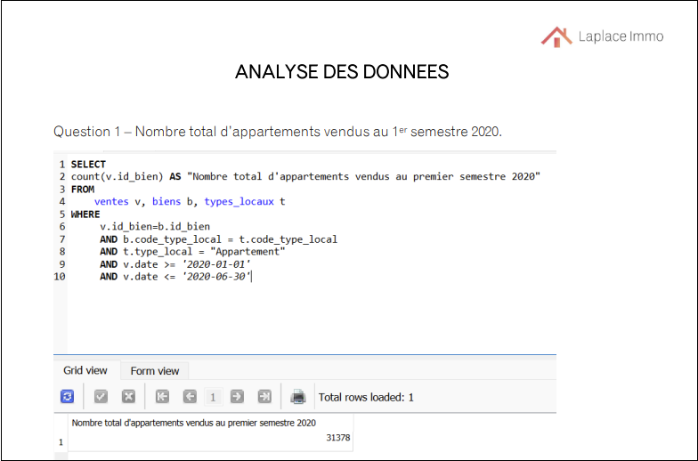

# Création d'une base de données pour les données immobilières avec SQL

#### Compétences techniques : Excel, draw.io, PowerQuery, SQLite, Word

Pour ce projet, j'ai joué le rôle d'une analyste de données travaillant pour "Laplace Immo" - un réseau national d'agences immobilières.

Le directeur général estime que l'agence doit essayer de se démarquer de la concurrence en créant un modèle pour mieux prédire le prix de vente des biens immobiliers.

Il m'a donc demandé de travailler sur le projet "DATAImmo". Ce projet consiste à modifier une base de données pour permettre la collecte de données sur les transactions immobilières en France.

Par la suite, on m'a demandé de réaliser une analyse du marché immobilier français pour permettre aux agences régionales de mieux accompagner leurs clients.

Dans ce contexte, il m'a confié la création d'une base de données pour collecter les transactions immobilières en France. L'entreprise pourrait alors utiliser la base de données pour analyser le marché et aider les différentes agences régionales à mieux accompagner leurs clients.

J'ai reçu 3 fichiers csv pour ce projet :
- données extraites du site open data pour les demandes de Valeur Foncière (DVF) ;
- données de l'INSEE avec les résultats des recensements de la population ;
- données de data.gouv sur les régions, avec la référence géographique française, les communes, les unités urbaines, les aires urbaines, les départements, les académies, les régions.

Le projet comprenait :
- Préparation d'un dictionnaire de données pour chaque fichier csv
- Création d'un schéma de base de données pour guider le développement de la nouvelle base de données
- Création de la nouvelle base de données en SQLite
- Analyse des données immobilières en SQLite

#### Voir l'analyse [ICI](https://flossytoo.github.io/portfolio-france/projet_3/Immobilier.pdf)

#### Voir le schéma de la base de données [ICI](https://flossytoo.github.io/portfolio-france/projet_3/Schema.png)
